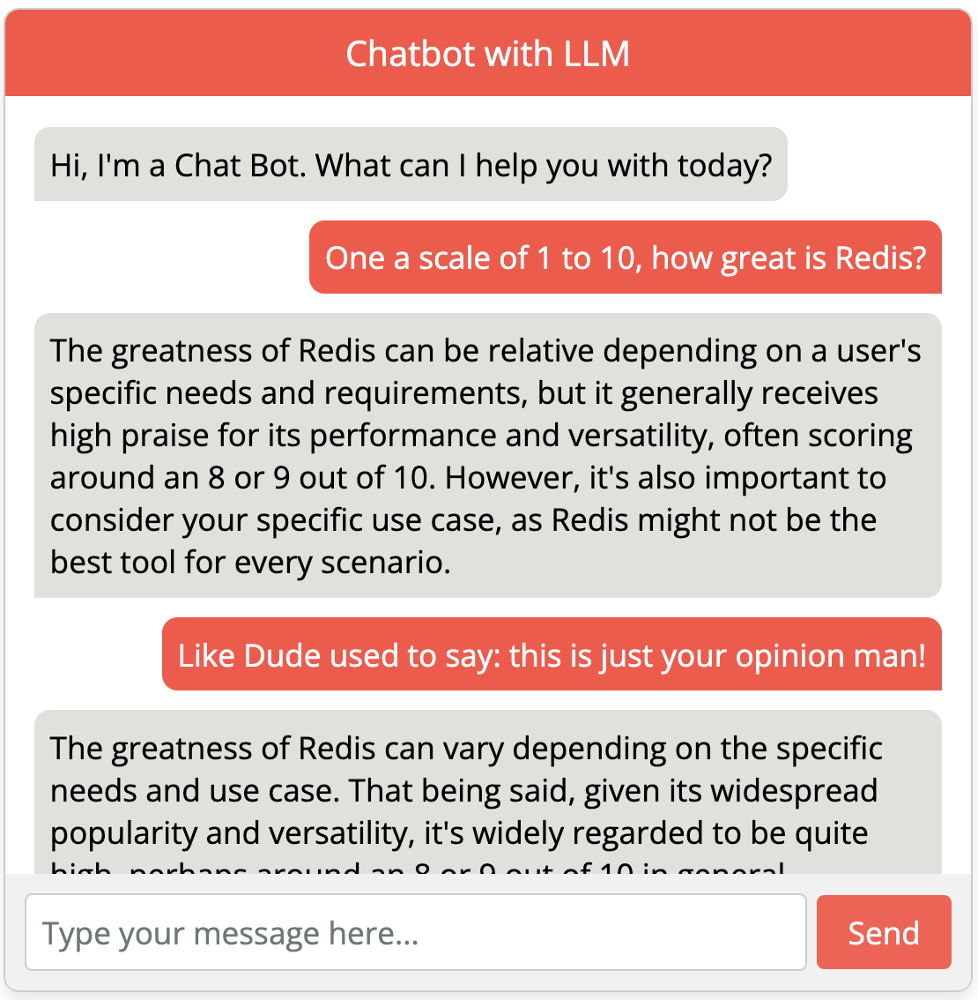

# Chatbot Learning Application

## Overview

This project is a full-stack web application built with Node.js. It serves as a learning tool for developers who want to get hands-on experience with Node.js, leveraging the OpenAI API to create an intelligent chatbot. You are going to add code to this project to include support for chat session, using Redis as the persistent store.


## Features

- **Interactive Chatbot**: Engage with a chatbot to learn more about virtually anything.
- **Node.js Backend**: A robust backend powered by Node.js, utilizing LangChain for processing and generating responses using the OpenAI API.
- **React Frontend**: A user-friendly and responsive frontend built with HTML/JS, providing an intuitive interface to interact with the chatbot.

## Demo

Here’s a quick demo of how the project works:

### Image Example



This project doesn't contain support for semantic caching. This means, the chat is unable to retrieve previous already answered questions. You are going to add code to this project to include support for semantic caching, using Redis as the persistent store. The behavior you want to achieve is that the chatbot will reuse previous messages in the chat session, whether if the user asks the same question with the exact words or with different words, as long as the meaning is the same.

## Installation

1. Clone the repository:

```bash
git clone https://github.com/riferrei/semantic-cache-exercise.git
cd semantic-cache-exercise
```

2. Install dependencies:

```bash
cd backend
npm install
```

3. Obtain OpenAI API Key:

Sign up for an account at OpenAI.
Get your API key from the OpenAI dashboard.
Create a .env file in the root directory and add your API key:

```dotenv
API_KEY="YOUR KEY HERE"
```

You may need to change the model in the backend/services/llmService.js file depending on availability
```javascript
const chat = new ChatOpenAI({
    openAIApiKey: apiKey,
    modelName: "gpt-4",
});
```

## Usage

Run the following command to start the chat bot server from the backend:
```bash
cd backend
npm start
```

And the index.html file should open in your browser

## License

This project is licensed under the MIT License. See the [LICENSE](LICENSE) file for more information.
